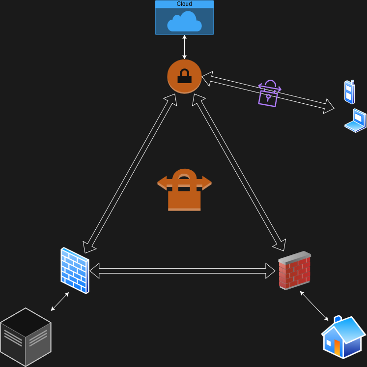

# Hybrid-Mesh: Azure + Colo + HomeLab

resilient, three-node hybrid network bridging Public Cloud (Azure), a Colocation Data Center, and a local Home Lab environment. This project demonstrates a full-mesh VPN topology with automated failover and secure P2P remote access.

## 🏗️ Architecture
This project implements a **Full Mesh** topology. While Azure typically acts as the high-bandwidth primary cloud gateway for transit routing, the design includes a direct "Backdoor" tunnel to ensure physical sites remain connected independently of the cloud provider.

* **Primary Path:** Traffic between the Home Lab and Colo transits through the Azure VNet Gateway to leverage Azure's backbone.
* **Failover Logic:** A direct Site-to-Site tunnel connects the Home Lab and Colo. This path is configured with a higher routing metric (cost), acting as an automated "Backdoor" that takes over only if the Azure transit path is unreachable.
* **P2P/Remote Access:** A Point-to-Site (P2S) VPN allows individual remote devices (iPhone/Laptop) to securely peer into the mesh. Once connected to the Azure Hub, these devices gain visibility into both the Home Lab and Colo via transit routing.

### Connectivity Breakdown
* **Azure VNet:** `10.10.0.0/16` (Hub)
* **Colo DC:** `TBD` (Spoke A)
* **Home Lab:** `TBD` (Spoke B)
* **P2S VPN (Mobile):** `TBD` (Remote Access)

---

## 🚀 Key Features
* **Encrypted Tunnels:** AES-256 IPsec S2S tunnels connecting all three physical locations.
* **Point-to-Site (P2S):** Secure roaming access for mobile devices (iPhone) via the OpenVPN protocol.
* **Transit Routing:** Enabled via Azure Virtual Network Gateway, allowing Spoke-to-Spoke communication.
* **Resilient Failover:** Automated path switching between the Azure Hub and the direct Home-to-Colo link.

---

## 🛠️ Hardware & Tools
| Location | Device/Provider | Tunnel Protocol |
| :--- | :--- | :--- |
| **Azure** | Virtual Network Gateway (VpnGw1) | IKEv2 / OpenVPN |
| **Colo DC** | TBD | IPsec |
| **Home Lab** | TBD | IPsec |

---

## 📝 Current Progress / Roadmap
- [ ] Design network CIDR scheme (No overlaps)
- [ ] Create Azure VNet and Gateway
- [ ] Establish S2S Tunnel: Azure <-> Home Lab
- [ ] Establish S2S Tunnel: Azure <-> Colo DC
- [ ] Configure P2S OpenVPN for iOS
- [ ] Test cross-site latency and routing

---

## 📂 Repository Structure
* TBD
---
