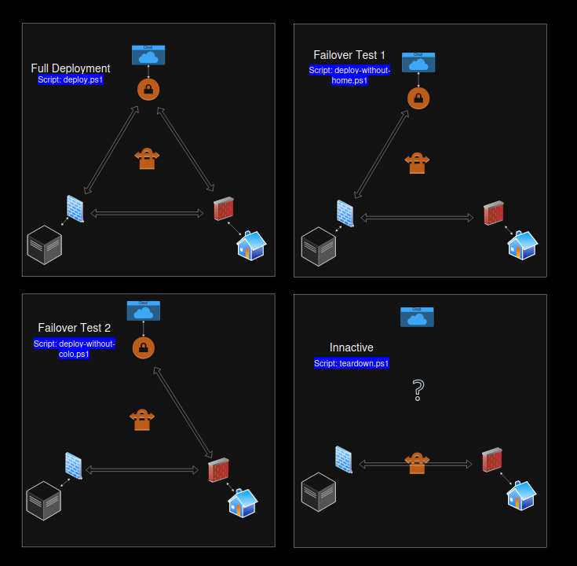

# Azure-Colo-Home-Interconnect

A resilient, three-node hybrid network bridging Public Cloud (Azure), a Colocation Data Center, and a local Home Lab. The design is a full-mesh VPN topology where the direct Home↔Colo link carries inter-site traffic by default, with Azure providing secondary transit and cloud attachment at each site.

## Architecture

The direct Site-to-Site tunnel between Home and Colo is the **primary transit path** for cross-site traffic. Azure S2S links attach each on-premises site to the cloud and provide a **secondary transit path** through the VNet Gateway when the direct link is unavailable. BGP on all tunnels enables automatic path selection based on routing cost.



The diagram above is a collage of every connectivity state this project can operate in. Each panel maps to a script-driven Azure configuration. The direct Home↔Colo tunnel is configured on-premises, is always active, and remains the preferred path for inter-site traffic regardless of which Azure state is deployed.

### Address Space

| Site | CIDR |
| :--- | :--- |
| **Azure VNet** | `192.168.100.0/24` |
| **Colo DC** | `10.252.0.0/16` |
| **Home Lab** | `192.168.2.0/24` |

### Connectivity States

| State | Azure Resources | Use Case |
| :--- | :--- | :--- |
| **Full Mesh** | VPN Gateway + Azure→Home + Azure→Colo | Production — direct Home↔Colo primary, Azure secondary transit available |
| **Home Only** | VPN Gateway + Azure→Home | Isolation test — Azure→Colo removed; Home↔Colo direct path remains primary |
| **Colo Only** | VPN Gateway + Azure→Colo | Isolation test — Azure→Home removed; Home↔Colo direct path remains primary |
| **No-Cost** | Gateway and connections removed, container stopped | Tear down billable VPN resources when not in use |

---

## Key Features

* **Encrypted Tunnels** — AES-256 IPsec S2S tunnels (IKEv2, DH14, PFS2048) connecting all three locations.
* **BGP Routing** — BGP enabled on the Azure VPN Gateway (ASN `65515`) and both S2S connections, with on-premises policy preferring the direct Home↔Colo path.
* **Resilient Failover** — Direct Home↔Colo tunnel is primary; Azure transit takes over automatically when the direct link fails.
* **Automated Deployment** — PowerShell scripts and ARM templates deploy, repair, isolate, or tear down Azure resources on demand.
* **Path Isolation Testing** — Partial-deploy scripts remove one Azure S2S link at a time to verify sites stay connected via the direct path and remain independent of partial Azure outages.

---

## Prerequisites

Install the Azure PowerShell module:

```powershell
Install-Module -Name Az -AllowClobber -Scope CurrentUser
```

Authenticate before running any script:

```powershell
Connect-AzAccount
```

The scripts assume the following already exist in the `Azure-Colo-Home-Interconnect` resource group (South Central US):

* VNet `SCUS-Interconnect-VNet` and `GatewaySubnet`
* Public IP `SCUS-Interconnect-PIP`
* Local Network Gateways `SCUS-Interconnect-LNGW-Home` and `SCUS-Interconnect-LNGW-Colo`
* Key Vault `SCUS-Interconnect-KVault` with secrets `S2S-Home-Secret` and `S2S-Colo-Secret`
* Container group `scus-interconnect-container`

The ARM templates in `automation/templates/` manage the VPN Gateway and S2S connections only.

---

## Automation

Scripts live in `automation/scripts/` and resolve template paths from the script location, so they can be run from any working directory.

| Script | Target State | What It Does |
| :--- | :--- | :--- |
| `deploy.ps1` | **Full Mesh** | Deploy/repair VPN Gateway, both S2S connections (PSK from Key Vault), and start the container |
| `deploy-without-colo.ps1` | **Home Only** | Full deploy except Azure→Colo; removes the Colo connection if it exists |
| `deploy-without-home.ps1` | **Colo Only** | Full deploy except Azure→Home; removes the Home connection if it exists |
| `teardown.ps1` | **No-Cost** | Stop container, remove both connections and the VPN Gateway |

### Examples

```powershell
# Full production connectivity
./automation/scripts/deploy.ps1

# Remove Azure→Colo link; verify Home↔Colo direct path still carries traffic
./automation/scripts/deploy-without-colo.ps1

# Remove Azure→Home link; verify Home↔Colo direct path still carries traffic
./automation/scripts/deploy-without-home.ps1

# Tear down billable VPN resources
./automation/scripts/teardown.ps1
```

---

## Hardware & Tools

| Location | Device / Provider | Role |
| :--- | :--- | :--- |
| **Azure** | Virtual Network Gateway (`VpnGw1AZ`) | Cloud attachment, secondary transit |
| **Colo DC** | OPNsense (virtualized) | IPsec S2S to Azure; direct primary tunnel to Home |
| **Home Lab** | Netgate FW | IPsec S2S to Azure; direct primary tunnel to Colo |

---

## Roadmap

- [x] Design network CIDR scheme (no overlaps)
- [x] Create Azure VNet and Gateway
- [x] Establish S2S tunnel: Azure ↔ Home Lab
- [x] Establish S2S tunnel: Azure ↔ Colo DC
- [x] Build automation scripts for deploy, partial deploy, and teardown
- [ ] Test cross-site latency and routing
- [ ] Document on-premises BGP and failover configuration

---

## Repository Structure

```
automation/
├── scripts/
│   ├── deploy.ps1                  # Full mesh
│   ├── deploy-without-colo.ps1     # Home-only (Azure isolation test)
│   ├── deploy-without-home.ps1     # Colo-only (Azure isolation test)
│   └── teardown.ps1                # No-cost state
└── templates/
    ├── vpn_gateway.json            # Gateway + BGP settings
    ├── home_connection.json        # Azure→Home S2S connection
    └── colo_connection.json        # Azure→Colo S2S connection
images/
└── deployment-states.png           # Collage of all deployment states
```
